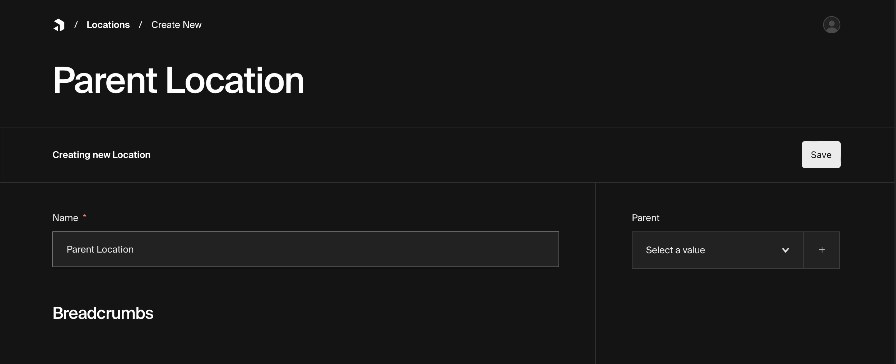
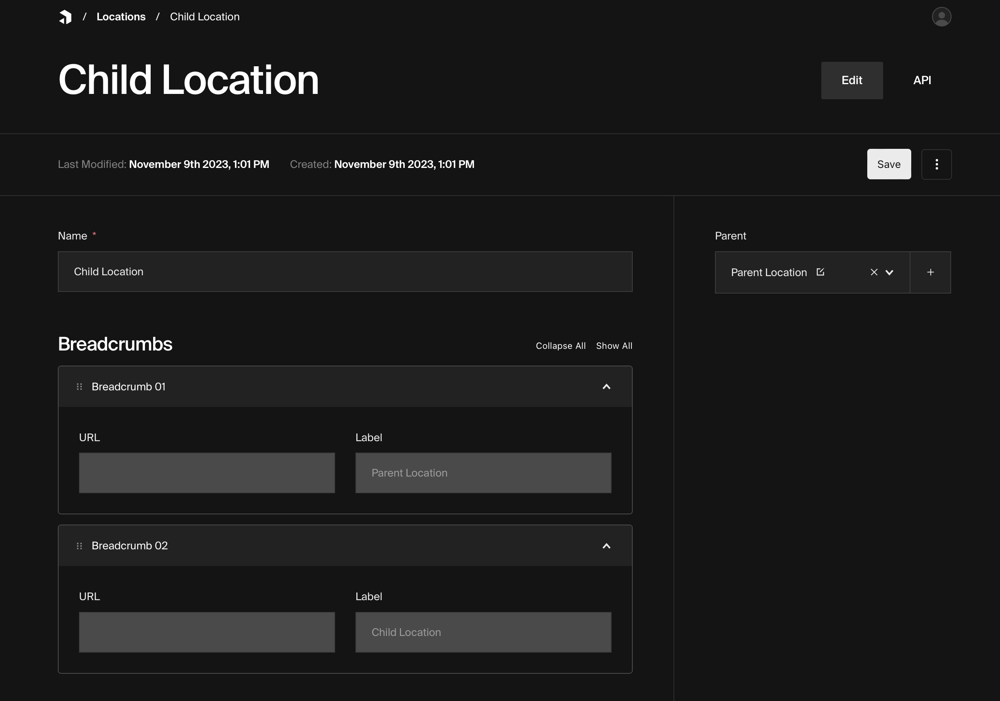

Reproduction for payload issue [4072](https://github.com/payloadcms/payload/issues/4072).

Note: I cannot reproduce this error in a self-hosted MongoDB environment, only in MongoDB Atlas.

## Steps to reproduce

### 1. Install the dependencies.

```
yarn install
```

### 2. Create a two new `Location` documents, one with the other set as a parent.





### 3. Navigate to the `Locations` list.

If there are no errors, go back to the newly created `Location` and update the `Parent` field by either adding or removing the parent. Then go back to the `Locations` list. You may need to do this a couple of times.

### 4. Check the console for errors.

If the frontend gets stuck in the loading skeleton, you should see the following error in the console.


```
<path/to/project>/node_modules/mongodb/src/transactions.ts:168
throw new MongoRuntimeError(
^
MongoRuntimeError: Attempted illegal state transition from [TRANSACTION_COMMITTED] to [TRANSACTION_ABORTED]
at Transaction.transition (<path/to/project>/node_modules/mongodb/src/transactions.ts:168:11)
at commandHandler (<path/to/project>/node_modules/mongodb/src/sessions.ts:740:27)
at <path/to/project>/node_modules/mongodb/src/sessions.ts:810:7
at <path/to/project>/node_modules/mongodb/src/utils.ts:462:14
at processTicksAndRejections (node:internal/process/task_queues:95:5)
```