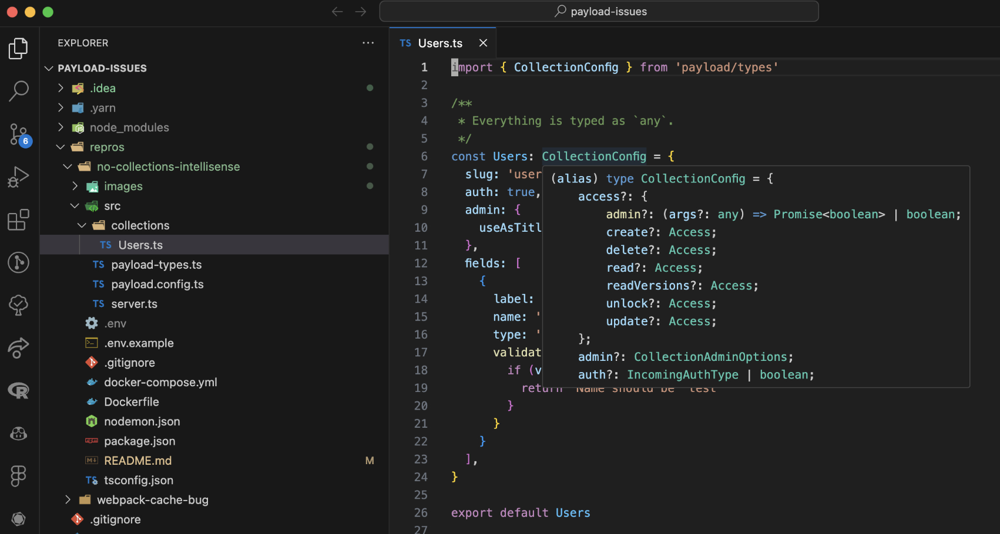
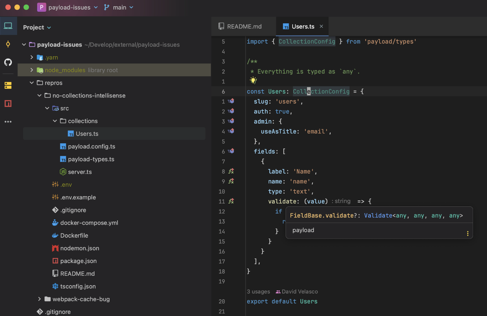

Reproduction for payload issue [#3840](https://github.com/payloadcms/payload/issues/3840).

### Steps to reproduce

Install the dependencies.

```
yarn install
```

Types are already generated in `./src/collections/payload-types.ts`.

Open `./collections/Users.ts` with VSCode or WebStorm and verify that the `Users` collection is typed as `any`.



This can be seen in the `validate` function as well, where the intellisense for the `value` type is also `any`.

